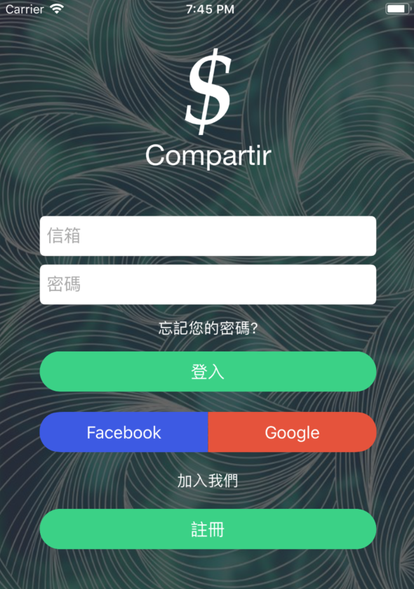
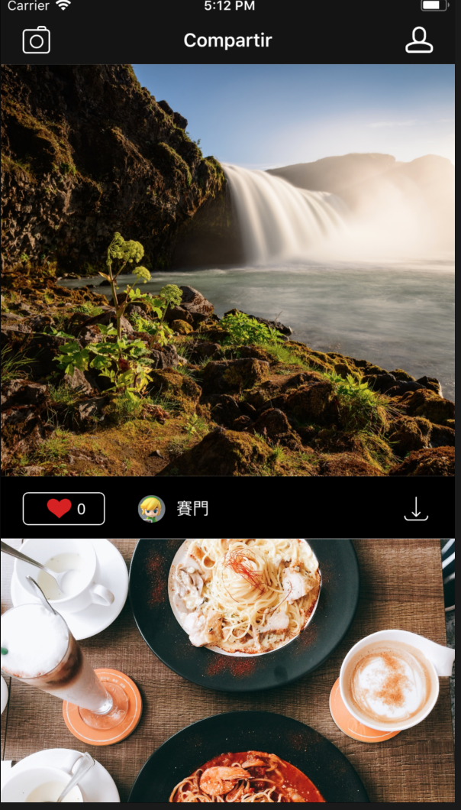

# 此專案目的

* 這個專案主要是用來練習FireBase結合整個app應用，其中包括使用者驗證(如Email，Facebook，Google登入驗證)，DataBase以及Storage的使用，利用FireBase本身的行動平台功能，加速整個app開發的速度，就算只有一個人也可以獨立完成全部的功能。

## 專案介紹

 - 專案名稱:money-pig(暫時取的本來應該要取名為Compartir分享的意思)
 - 專案語法:Swift4
 - Demo圖

